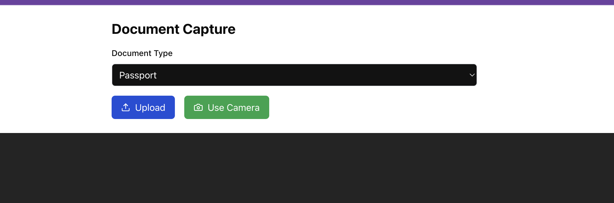

# Document Capture Application

This application enables users to capture, upload, and extract information from **Driving Licenses**, using OCR technology to retrieve key details and validate the document's expiration status.

## Table of Contents

1. [High-Level System Design](#high-level-system-design)
2. [Backend API Overview](#backend-api-overview)
3. [Feedback and Iteration](#feedback-and-iteration)
4. [Sample Images](#sample-images)

---

## High-Level System Design

The application is composed of a React frontend and a Node.js backend API. This separation of frontend and backend allows for modular development and ease of deployment.

### 1. **Frontend (React)**

- Enables users to select document types, upload or capture images, and preview the uploaded documents.
- Sends the image or document file to the backend API for processing.
- Receives and displays extracted document data and validation status.

### 2. **Backend (Node.js)**

- Accepts image files from the frontend and processes them using Optical Character Recognition (OCR) via Tesseract.js.
- Extracts specific document information including name, document number, issue date, and expiry date.

### 3. **Document Validation**

- The backend performs checks to validate the document's expiration status by comparing the current date with the extracted expiry date.
- Displays a status indicating whether the document is "Valid" or "Expired" based on this comparison.

## Backend API Overview

The backend API is designed to handle image file uploads, perform OCR on the images, and return the extracted data to the frontend.

### API Endpoints

1. **POST /api/process-document/**
   - Receives the uploaded file and the selected document type from the frontend.
   - Uses Tesseract.js to extract key document details.
   - Validates extracted data and returns it along with the expiration status to the frontend.

### Data Extraction & Validation

The backend leverages OCR to extract essential fields:

- **Full Name**
- **Document Number**
- **Date of Issue**
- **Date of Expiry**

Once extracted, the backend checks the expiry date against the current date to label the document as “Valid” or “Expired.”

---

## Feedback and Iteration

- For this project, Tesseract.js was utilized to handle the OCR process for extracting details from driving license images.
- While Tesseract.js was effective, I also attempted to improve extraction accuracy by integrating a custom model tailored for the specific document structure. Unfortunately, this approach did not yield the desired improvements. However, using a more refined custom model could enhance accuracy significantly in future iterations.

---

## Sample Images

- 
- 
- 
- 

---

This README provides a comprehensive overview of the Document Capture Application, detailing its design, backend API, and feedback on OCR implementation.
